[](https://classroom.github.com/open-in-codespaces?assignment_repo_id=21671952)

# Trabalho Prático 2 (TP2) - Desenvolvimento de Interface Web

**TP2 DIW**: Projeto completo de uma aplicação web responsiva com autenticação de usuários, CRUD de dados, busca, sistema de favoritos e visualizações avançadas.

## Informações do Trabalho

- **Nome:** Pedro Dias Soares
- **Matricula:** 879672
- **Proposta de projeto escolhida:** Organizações e Equipes
- **Nome do Projeto:** Organize - Hub de Colaboração para DEVs

---

## 📋 Descrição do Projeto

**Organize** é um hub de colaboração para desenvolvedores onde usuários podem:

- **Criar e gerenciar equipes de desenvolvimento** com informações sobre vagas, tecnologias usadas e membros
- **Publicar notícias e artigos** de tecnologia para compartilhar conhecimento
- **Autenticar-se no sistema** com login/registro seguro via sessionStorage
- **Marcar favoritos** de equipes para acompanhá-las facilmente
- **Explorar visualizações avançadas** de dados através de gráficos interativos
- **Buscar e filtrar** equipes por nome, descrição e tecnologias

### Stack Tecnológico

- **Frontend:** HTML5, CSS3, JavaScript (Vanilla)
- **Styling:** Tailwind CSS + FontAwesome
- **Backend:** JSON Server (simulado)
- **Dados:** JSON persistido em arquivo
- **Autenticação:** sessionStorage
- **Visualizações:** Chart.js

---

## 🏗️ Estrutura de Pastas

```
TP2-Organize/
│
├── public/                        # Arquivos públicos servidos pela aplicação
│   ├── index.html                 # Página inicial
│   ├── login.html                 # Autenticação de usuários
│   ├── cadastro_equipe.html        # Formulário de cadastro de equipes
│   ├── cadastro_noticia.html       # Formulário de publicação de notícias
│   ├── dashboard.html              # Painel de controle do usuário
│   ├── detalhes.html              # Detalhes de uma equipe
│   ├── editar_equipe.html         # Edição de equipes
│   ├── editar_noticia.html        # Edição de notícias
│   ├── equipe-chat.html           # Chat/discussão da equipe
│   ├── equipes.html               # Listagem de equipes
│   ├── estatisticas.html          # Gráficos e estatísticas
│   ├── favoritos.html             # Equipes favoritadas do usuário
│   ├── noticia-detalhe.html       # Detalhes de uma notícia
│   ├── perfil.html                # Perfil do usuário
│   ├── sobre.html                 # Informações sobre o projeto
│   │
│   └── assets/
│       ├── css/
│       │   └── style.css           # Estilos customizados
│       ├── img/                    # Imagens do projeto
│       └── scripts/
│           ├── app.js              # Lógica principal da aplicação
│           ├── auth.js             # Autenticação e menu dinâmico
│           ├── cadastro-equipe.js  # Gerenciamento de equipes
│           ├── cadastro-noticia.js # Gerenciamento de notícias
│           ├── dashboard.js        # Lógica do dashboard
│           ├── editar-equipe.js    # Edição de equipes
│           ├── editar-noticia.js   # Edição de notícias
│           ├── equipe-chat.js      # Chat da equipe
│           ├── perfil.js           # Lógica do perfil
│           └── stats.js            # Gráficos e estatísticas
│
├── db/
│   └── db.json                    # Banco de dados JSON (persistência)
│
├── server.js                      # Servidor (JSON Server + Static Files)
├── package.json                   # Dependências do projeto
├── .gitignore                     # Arquivos ignorados pelo Git
└── README.md                      # Este arquivo

```

---

## ✨ Funcionalidades Implementadas

### 1. **Autenticação de Usuários** ✅
- Login com email e senha
- Registro de novos usuários
- Sessão mantida via `sessionStorage`
- Logout funcional
- Menu dinâmico (login → logout)

### 2. **CRUD de Equipes** ✅
- **Create:** Formulário de cadastro em `cadastro_equipe.html`
- **Read:** Listagem em `index.html` e `equipes.html`, detalhes em `detalhes.html`
- **Update:** Edição em `editar_equipe.html`
- **Delete:** Exclusão na página de detalhes (admin)

### 3. **CRUD de Notícias** ✅
- **Create:** Formulário de publicação em `cadastro_noticia.html`
- **Read:** Carrossel na home, listagem em `noticia-detalhe.html`
- **Update:** Edição via `dashboard.html` → `editar_noticia.html`
- **Delete:** Exclusão no dashboard (autor)

### 4. **Sistema de Favoritos** ✅
- Usuários logados podem favoritar equipes
- Ícone do coração muda de estado (vazio/cheio)
- Página de favoritos dedicada
- Dados persistidos na API

### 5. **Busca e Filtros** ✅
- Busca por nome de equipe
- Filtro por stack tecnológico
- Pesquisa em tempo real com debounce

### 6. **Visualizações Avançadas** ✅
- Gráfico de pizza (doughnut) com Chart.js na home
- Página de estatísticas com múltiplos gráficos
- Market share de tecnologias
- Distribuição de notícias por categoria

### 7. **Interface Responsiva** ✅
- Design mobile-first
- Media queries para desktop
- Tailwind CSS para estilização
- Menu mobile com toggle

### 8. **Identificação do Autor** ✅
- Perfil do desenvolvedor na home
- Avatar, bio, links sociais (GitHub, LinkedIn)
- Página de perfil dedicada

---

## 🚀 Como Executar

### Pré-requisitos
- Node.js 16+ instalado
- npm (gerenciador de pacotes)

### Instalação

1. **Clonar/Entrar na pasta do projeto:**
```bash
cd Tp2
```

2. **Instalar dependências:**
```bash
npm install
```

3. **Iniciar o servidor:**
```bash
npm start
```

O servidor estará rodando em `http://localhost:3000`

### Dados de Teste

**Usuário Admin:**
```
Email: pedro3soares@gmail.com
Senha: 123
```

**Usuário Comum:**
```
Email: visitante@teste.com
Senha: 123
```

---

## 📊 Endpoints da API

| Método | Endpoint | Descrição |
|--------|----------|-----------|
| GET | `/usuarios` | Lista todos os usuários |
| POST | `/usuarios` | Cria novo usuário |
| GET | `/equipes` | Lista todas as equipes |
| POST | `/equipes` | Cria nova equipe |
| PUT | `/equipes/:id` | Atualiza equipe |
| DELETE | `/equipes/:id` | Deleta equipe |
| GET | `/noticias` | Lista notícias |
| POST | `/noticias` | Publica notícia |
| PUT | `/noticias/:id` | Atualiza notícia |
| DELETE | `/noticias/:id` | Deleta notícia |
| GET | `/favoritos` | Lista favoritos |
| POST | `/favoritos` | Adiciona favorito |
| DELETE | `/favoritos/:id` | Remove favorito |

---

## 📸 Screenshots

*Será adicionado prints da aplicação em funcionamento*
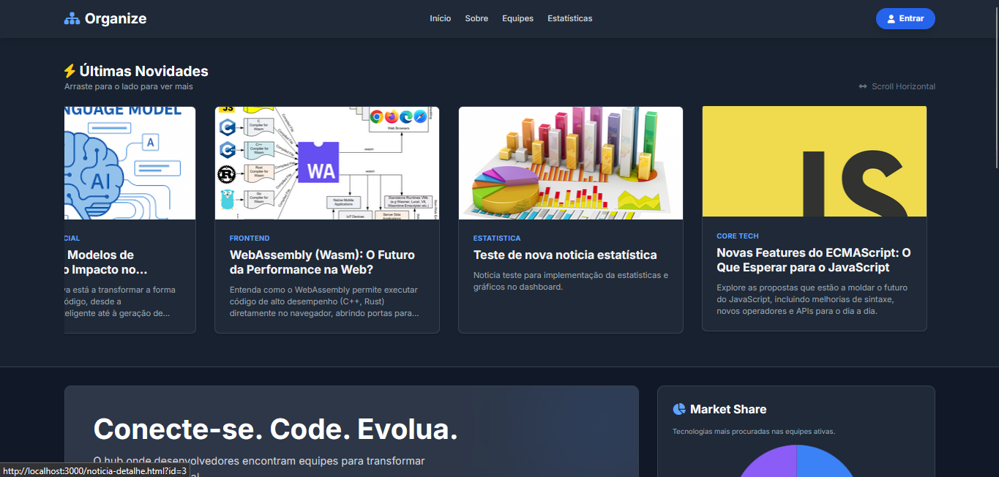
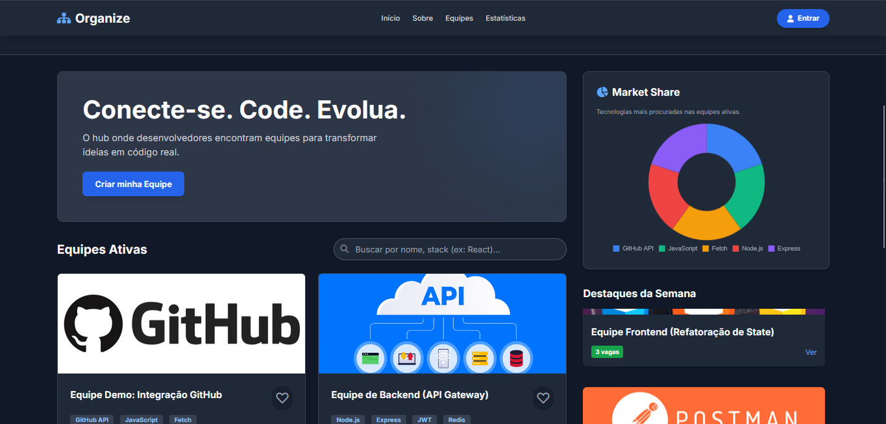
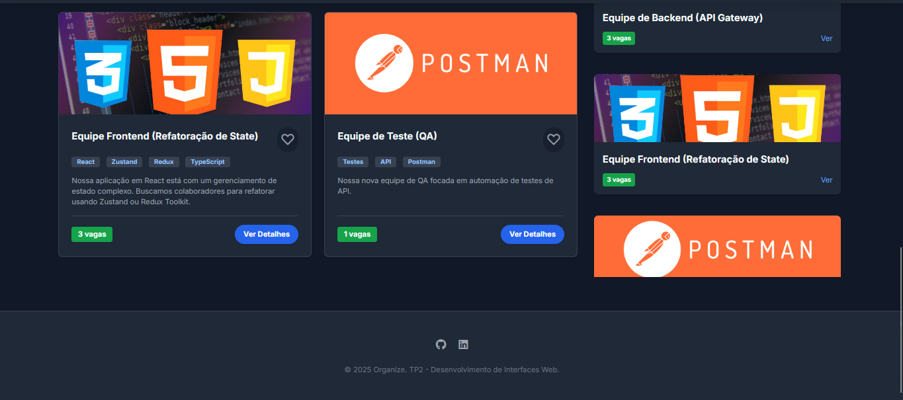

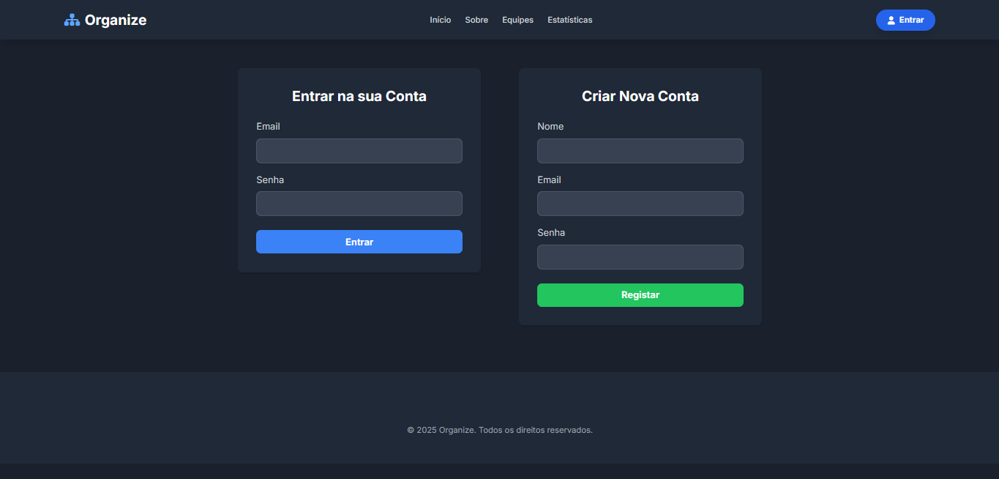
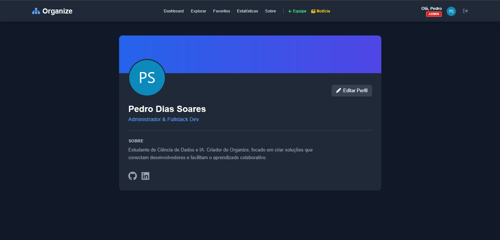

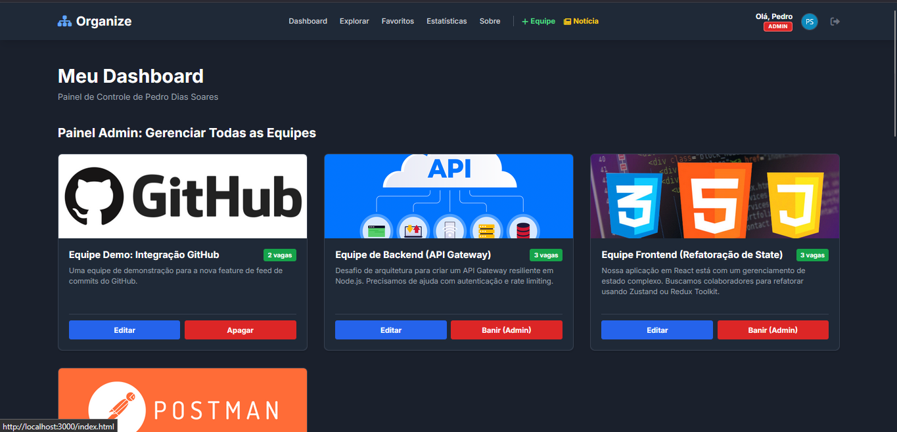
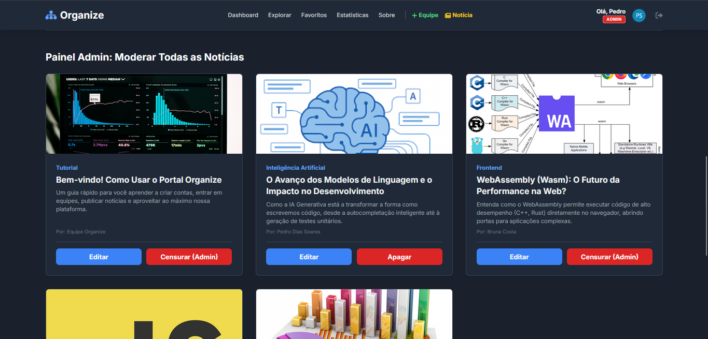
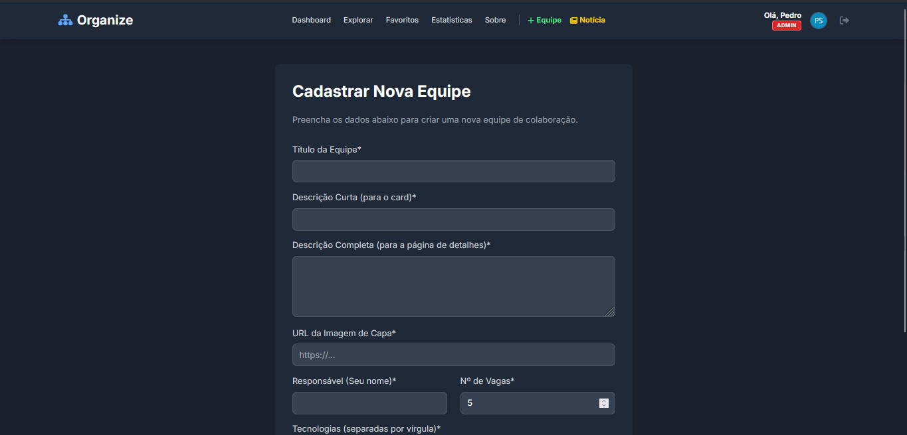
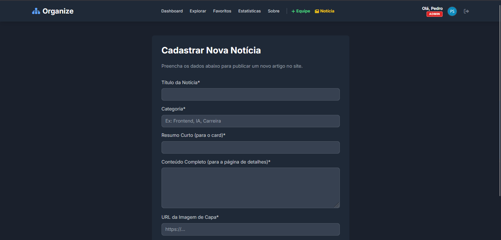

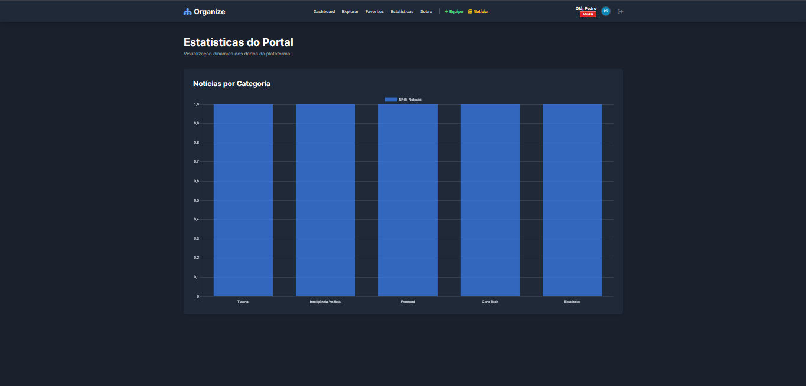

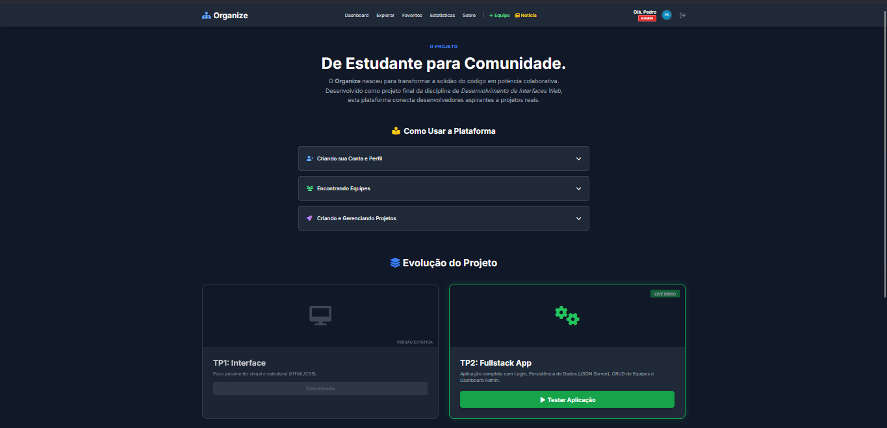
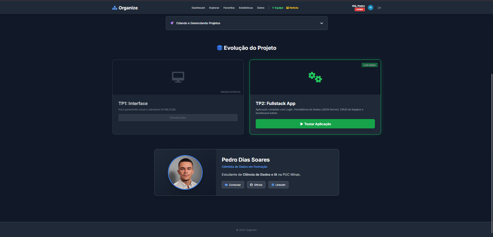

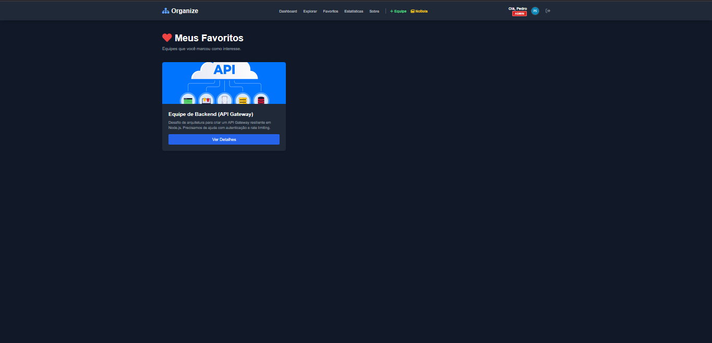

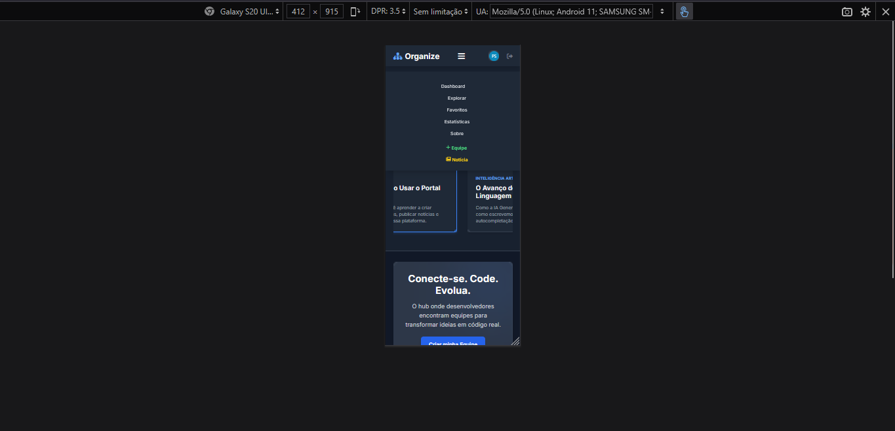
---

## 👤 Autor

**Pedro Dias Soares**
- GitHub: [pedrinndias](https://github.com/pedrinndias)
- Email: pedro3soares@gmail.com
- Matricula: 879672

---

## 📝 Licença

ISC - Desenvolvido como trabalho acadêmico em Desenvolvimento de Interfaces Web.